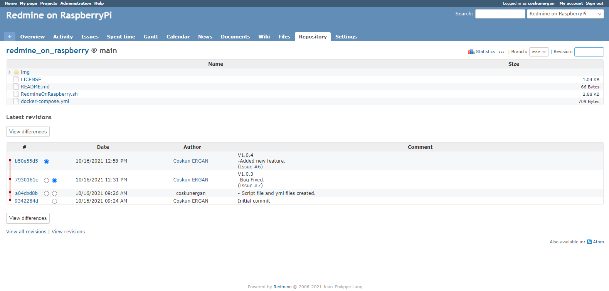

# RaspberryPi üzerinde Redmine Proje Takip Sistemi kurulumu ve işletilmesi

# 1-Motivasyon

Gömülü yazılımcılar şirketlerin görünmez kahramanlarıdır, projelerdeki geliştirmeleri ve hata düzelmelerini tam zamanında ve en kısa yoldan yapmaları beklenir. İş döngüsü bu şekildedir ve tekrar eder. Bu döngüye destek sağlamak iş takibini kolaylaştırmak amacıyla hazırlanmış proje yönetim sistemleri arge firmalarının vazgeçilmezidir. Bu başlıkta en populer proje takip sistemlerinden birisi olan **açık kaynaklı [Redmine](https://www.redmine.org/)  proje takip** yazılımını RPi üzerine kurup işletilmesinden bahsedeceğim.

Ayrıca bu kurulum daha önce yayınlamış olduğum [Gitea On RaspberryPi](https://github.com/coskunergan/gitea_on_raspberry) Gitea Server ile Redmine entegrasyonunu içermektedir. Dolayısıyla önce [Gitea](https://github.com/coskunergan/gitea_on_raspberry) kurulumunu tamamlamanızı öneririm.

# 2-Donanım

Kurulum için daha önceden Gitea Server kurup yayımladığım RaspberryPi3B cihazını kullanıyorum. 

# 3-Redmine Kurulumu

Öncelikle [RedmineOnRasppberry.sh](https://github.com/coskunergan/redmine_on_raspberry/blob/main/RedmineOnRaspberry.sh) dosyasına gidip tamilatları izleyerek cihazınıza Redmine kurulumunu tamamlayınız. Sonrasında ayarlamalar ve gitea entegrasyonu için aşağıdan devam edeceğiz.

# 4-Redmine Ayarları

Kurulum sonrası http://localhost:5000 adresi üzerinden redmine ana sayfasına girmiş olmalısınız. Admin olarak giriş yapmak için admin kullanıcı adı ve şifresi "admin" dir. ilk girişinizde Redmine sizden yeni bir admin şifresi oluşturmanızı isteyecektir. 
  
Önemli Not: Admin girişi sonrasında Redmine ilk kuruluma özel default rol ve tanımlamaların yapılmasını önerecektir. Henüz ayarlara dokunmadan buradan dil seçeneğini seçip default kurulumu kabul etmenizi öneriyorum. Aksi halde Bug, Feature, Support gibi temel iş gurupları dahil tüm alanları sizin oluşturmanızı isteyecektir. Bununla uğraşmak istemeyebilirsiniz işin trajikomik tarafı bu öneriyi daha sonra geri dönülmesi mümkün olmayan ilk kurulum ekranında sunması. :) Gerçekten dahice.
  
# 5-Redmine Gitea Entegrasyonu
  
İlk iş olarak ayarlar sekmesinden aşağıdaki görselde olduğu gibi bir api key oluşturmanız gerekiyor. Bu key bizim gitea repolarında oluşan değişiklikleri redmine tarafına aktarmamızda kullanılacak.
  
Ayrıca ileride işimize yarayacağı için referance keyword kutusuna "Issue" text anahtarını eklemeyi unutmayınız.
  
  
  
  
  
  
  
  Şimdi yukarıda oluşturulan keyi alt satırdaki link sonuna yapıştırıp aşağıdaki görselde yer alan gitea -> Site Administrator -> Webhook sekmesine giderek yapıştırıyoruz. Böylece bir bağlantı oluşturuluyor. Bu bağlantı sayesinde Gitea Server içerisindeki depolarda gerçekleşen her bir git-push işleminde Redmine linki çalıştırılıyor ve Redmine commit aktiviteleri güncellenmiş oluyor.
  
  http://localhost:5000/sys/fetch_changesets?key=FYfTGGXIrIvfWbAyRhRP
  
 
  
   
  

  
  # 6-Redmine Git Repositories Kurulumu
  
  Sıra geldi Gitea içerisinde barındırdığımız bir repositories içeriğinin Redmine üzerinden erişilmesine. Bunun için öncelikle bir Redmine projesi oluşturmalısınız. Daha sonra aşağıda görüldüğü gibi ilgili projenin ayarlarındaki Settings->Repositories sayfasındaki "New Repository" butonuna tıklayarak aşağıdaki sayfada işaretli alanları dolduruyoruz.
  
  Burada en önemli nokta /my_repos/ path adresinden sonrasını kendi bare repository konumunuza göre doğru olarak değiştirmenizdir.
  
 
  
   
  
  
  
  Bu aşamanın sonunda repository aşağıda görüldüğü gibi tanıtılmış olacak.
  
  
    
  
  
  Eğer herşeyi doğru yaptıysanız artık projenin repositories sekmesinde aşağıdaki gibi git commit verileri ekranda görülür olacaktır.
  
  
  
   
  

  
  # 7-Redmine Tortoise ve TurtleMine Entegrasyonu
  
  Gelelim son konumuza. Populer windows git client uygulaması olan Tortoise ile TurtleMine eklentisini kullanarak Açık Redmine konularına entegre olmamız gerekiyor.
  
  Başlamadan önce bilgisayarınıza [TortoiseGit](https://tortoisegit.org) yazılımını ve [TurtleMine](https://code.google.com/archive/p/turtlemine/downloads) eklendisini sırasıyla kurmuş olmanız gerekiyor. 
  
  Kurulumları tamamlayıp devam ediyoruz.
  
  Bu entegrasyon için kullanacağımız parameters linkini aşağıdaki görselde gördüğünüz gibi ilgili projenin issue sekmesindeki "Atom" bağlantısına sağ tıklayıp "bağlantı adresini kopyala" seçeneğini kullanarak kopyalıyoruz.
  
  
  
   
  
  
  
  Şimdi ilgili git repository için clone oluşturmulmalı ve bu clone üzerine sağ tıklayıp TortoiseGit->Settings->issueTrackerIntegration ayarlarını aşağıdaki sırayla doldurmalıdınız. Buradaki parameters kutusuna yuarıdaki görseldeki atom linkinden kopyaladığımız bağlantıyı yapıştırıyoruz. Working Tree Path adresine ise repository dosyalarımızın clone adresini girmelisiniz. 
  
  
  
   
  
  
  
  Entegrasyonu tamamladık. 
  
  Şimdi bir aşağıdaki örnekte olduğu gibi issue adresi iliştirilmiş bir commit girelim.
  
  
  
  
  
  
  
  Commit'i git server a push etmeden önce aşağıdaki gibi görünmelidir.
  
  Burada en önemli nokta (Issue #x) text eklentisi olmasıdır. Redmine commit taraması yaparken bu anahtar text sayesinde konuları birleştirmektedir.
  
  
  
  
  
  
  Commit işlemini tamamladıktan sonra ilgili projenin Redmine issue sayfasında aşağıdaki resimde görüleceği üzere belirmiş olması lazım.
  
  
  
  
  Ayrıca Redmine Aktivity sekmesinde girmiş olduğumuz issue kayıtlı commit bilgisini aşağıdaki gibi görebiliyor olmamız gerekiyor.
  
  
  
  
  Tebrikler. Kurulumu tamamladınız. 
  
  
  
  
